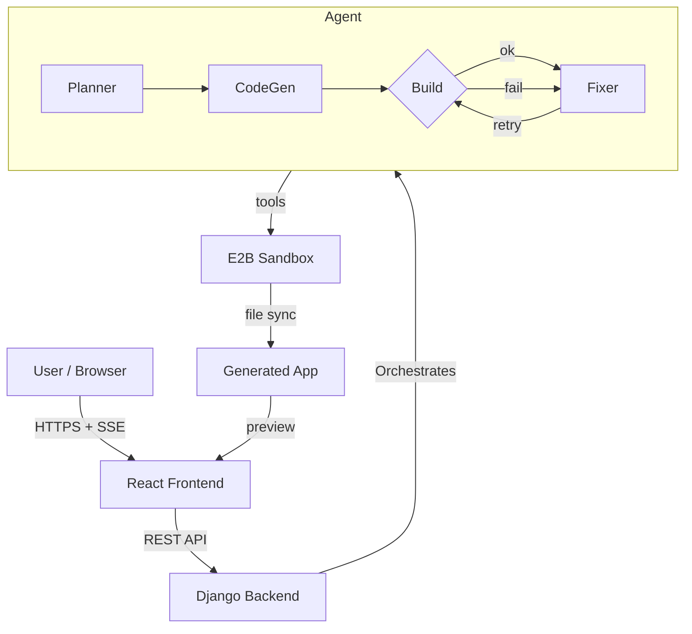

# Davable - AI Website Builder

Full-stack AI app builder. Describe a web app in plain language → the agent plans, generates, builds, and fixes a working React + Vite + Tailwind application running in an E2B sandbox.

## System Architecture



**Components:**
- **Frontend**: React + Vite + Tailwind v4. Auth (JWT + OAuth), chat UI, live preview iframe, file tree, code viewer.
- **Backend**: Django + DRF. Auth (JWT, Google/GitHub OAuth), conversations stored in SQLite, SSE streaming for agent progress.
- **Agent**: Multi-step pipeline using `pydantic-ai` + Groq `gpt-oss-120b`.
  - **Planner**: Distills prompt → brief + concrete steps, or asks clarifying questions.
  - **CodeGen**: Emits all files at once as structured JSON (React + JSX + Tailwind).
  - **Fixer**: Tool-using agent (`search`, `read_file`, `apply_patch`, `create_file`, `delete`, `exec`). Creates missing pages/routes, wires `react-router-dom`, re-runs `npm run build` until green or budget exhausted.
  - **Executor**: E2B sandbox per project. `write_file`/`sync` keeps host↔sandbox in lockstep. `npm run build` and `npm run dev` run inside the sandbox; preview served on `*.e2b.app`.

## Project Structure

```
mini-lovable/
├── backend/                    # Django project + agent
│   ├── config/                 # Django settings, URLs, wsgi
│   ├── builder/                # Auth, conversations, REST + SSE views
│   └── agents/                 # Core agent logic
│       ├── aci.py              # Narrow tool surface (search/read/patch/exec)
│       ├── policy.py           # Path containment + output caps
│       ├── scaffold.py         # Tailwind entry + template CSS neutralisation
│       ├── executor.py         # E2B sandbox + host↔sandbox sync
│       ├── planner.py          # Prompt → brief + steps
│       ├── codegen.py          # Prompt + steps → all files (JSON)
│       ├── system.py           # System prompts (planner/codegen/fixer)
│       ├── agent.py            # Orchestration, fixer loop, follow-ups
│       ├── store.py            # Per-project state (events, build status, fix attempts)
│       ├── state.py            # Conversation DB helpers
│       └── tests_*.py          # Assert-based unit tests
├── frontend/                   # React + Vite + Tailwind UI
│   ├── src/
│   │   ├── components/ui/      # shadcn/ui (Button, Card, Alert, etc.)
│   │   ├── pages/              # Landing, Home, Conversation, Auth
│   │   └── icons.jsx           # Brand marks
│   └── vite.config.js
└── .env                        # GROQ_API_KEY, E2B_API_KEY, secrets
```

## Key Capabilities

- **Initial build**: Prompt → plan → scaffold → codegen → build → auto-fix loop → preview.
- **Follow-ups**: “Add a landing page at `/` and move the app to `/todos`.” Fixer creates `src/Landing.jsx`, wires `react-router-dom` in `main.jsx`, re-builds, and self-heals if codegen overwrites the Tailwind entry.
- **Sandboxed execution**: Every project lives in its own E2B sandbox with isolated `node_modules`; host workspace mirrors sandbox for file browsing.
- **Streaming UX**: Agent progress (plan, steps, tool calls, build output) streamed via SSE to the chat UI.
- **Auth & history**: Email/password + Google/GitHub OAuth; conversations persisted with status, preview URL, and file tree.

## Quick Start

### Prerequisites
- Python 3.10+
- Node.js 20+
- E2B API key
- Groq API key

### 1. Clone & Configure

```bash
git clone https://github.com/DarshanPandey515/mini-lovable.git
cd mini-lovable
cp .env.example .env   # fill in GROQ_API_KEY, E2B_API_KEY, etc.
```

### 2. Backend

```bash
python -m venv .venv
source .venv/bin/activate
pip install -r backend/requirements.txt
python backend/manage.py migrate
python backend/manage.py runserver
```

### 3. Frontend

```bash
cd frontend
npm install
npm run dev
```

Open `http://localhost:5173`.

## Agent Workflow (Updated)

1. **Prompt** → **Planner** returns `{brief, todos[]}` or clarification questions.
2. **Scaffold** creates a fresh Vite project, installs `react-router-dom` + `tailwindcss @tailwindcss/vite`, writes a clean `src/index.css` with `@import "tailwindcss"`, and blanks `src/App.css`.
3. **CodeGen** emits all files at once (`App.jsx`, components, styles).
4. **Build** runs `npm run build`. If it fails:
   - **Fixer** searches/reads/patches/creates files, then re-runs `npm run build`.
   - Capped per-error fingerprint (3 retries) + global step budget (15 steps).
   - If the build still fails on the same error → escalate instead of looping.
5. **Preview** starts `npm run dev` in the sandbox; URL streamed to the UI.
6. **Follow-up**: user asks a change → snapshot → fixer applies → build gate → auto-revert on regression.

## Environment Variables

| Key | Required | Description |
|-----|----------|-------------|
| `GROQ_API_KEY` | yes | Groq API for `gpt-oss-120b` |
| `E2B_API_KEY` | yes | E2B sandbox access |
| `DJANGO_SECRET_KEY` | yes | Django signing |
| `DEBUG` | no | `true`/`false` |
| `ALLOWED_HOSTS` | no | Comma-separated |
| `GOOGLE_CLIENT_ID/SECRET` | no | Google OAuth |
| `GITHUB_CLIENT_ID/SECRET` | no | GitHub OAuth |
| `FRONTEND_URL` | no | CORS origin for OAuth redirects |

## Testing

```bash
cd backend
python -m agents.tests_aci      # ACI tools + policy
python -m agents.tests_state    # Project state store
python -m agents.tests_scaffold # Tailwind entry guard
python manage.py check          # Django system check
```
